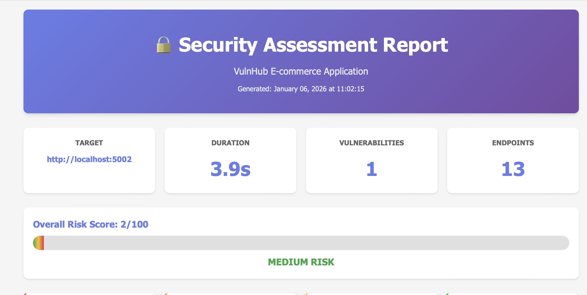

# SafeBuyr — E-commerce Security Platform

[](https://github.com/ChrisCortesSanchez/SafeBuyr/actions/workflows/ci.yml)


A full-stack web security research project that reproduces 6 OWASP Top 10
vulnerabilities in a deliberately vulnerable e-commerce application, pairs each
with a hardened side-by-side implementation, and validates every fix through a
custom 1,200+ line automated vulnerability scanner with an 8-phase assessment
pipeline.

Designed to demonstrate offensive and defensive security skills end-to-end:
exploit development, secure coding, CVSS-based risk quantification, and
automated security validation via CI/CD. Achieved a **95% reduction in
application risk score** (37/100 → 2/100) across the hardened implementation.

---

## How This Project Works

SafeBuyr ships as **two fully functional versions of the same e-commerce application** that run simultaneously on separate ports — the vulnerable version exposes every flaw intentionally, and the hardened version fixes each one with production-grade controls. The exploit scripts, scanner, and CI pipeline all target both, making the security impact of every fix directly observable.

| | Vulnerable Version | Hardened Version |
|-|-------------------|-----------------|
| **Purpose** | Demonstrates how each vulnerability works and is exploited | Shows the correct, production-grade fix for every issue |
| **Password storage** | MD5 without salt — crackable in seconds | bcrypt with cost factor 12 |
| **SQL queries** | Raw string concatenation — injectable | Parameterized queries via SQLAlchemy ORM |
| **Output encoding** | Jinja2 `\|safe` filter — XSS possible | Automatic escaping, `\|safe` removed |
| **Authorization** | None — any user can access any resource | User ID validation enforced on every endpoint |
| **CSRF protection** | No tokens — state-changing forms unprotected | Flask-WTF tokens on all forms |
| **Security headers** | 0 of 6 headers present | 5 of 6 headers implemented |
| **Risk score** | 37/100 (High Risk) | 2/100 (Excellent) |

---

## Sample Report Output



---

## Features

- **6 OWASP Top 10 vulnerabilities** reproduced with working proof-of-concept exploits
- **7 exploitation scripts** covering individual attack vectors and a full automated attack chain
- **8-phase vulnerability scanner** with CVSS-based risk scoring and HTML report generation
- **Side-by-side implementations:** vulnerable and hardened versions of every endpoint
- **95% risk reduction** validated end-to-end by the scanner (37/100 → 2/100)
- **Automated CI/CD pipeline:** GitHub Actions with Docker, running regression tests on every push and pull request
- **Executive-ready HTML reports** with severity breakdowns and remediation guidance

---

## Architecture

```
SafeBuyr/
├── app/
│   ├── models.py                    # Shared SQLAlchemy models
│   ├── static/                      # CSS, images
│   ├── templates/                   # Vulnerable Jinja2 templates (|safe filter, no CSRF tokens)
│   ├── app.py                       # Vulnerable Flask app (MD5 hashing, raw SQL, no authz)
│   └── data/
│       ├── ecommerce.db             # Vulnerable database seeded with MD5 password hashes
│       └── seed_data.py
│   └── secured/
│       ├── templates/               # Hardened templates (output encoding, CSRF tokens)
│       ├── app_secure.py            # Hardened Flask app (bcrypt, parameterized queries, authz)
│       └── data/
│           ├── ecommerce_secure.db  # Hardened database seeded with bcrypt hashes
│           └── seed_data_secure.py
├── exploits/
│   ├── 01_sql_injection.py          # Login bypass and data extraction
│   ├── 02_xss_attack.py             # Stored XSS via product reviews
│   ├── 03_idor_attack.py            # Unauthorized order and cart access
│   ├── 04_password_cracking.py      # MD5 hash cracking demonstration
│   ├── 05_csrf_attack.py            # State-changing request forgery
│   ├── 06_session_hijacking.py      # Cookie theft via XSS
│   └── 07_automated_attack_chain.py # Full recon-to-exploit chain
├── scanner/
│   └── vulnerability_scanner.py     # 1,200+ line 8-phase scanner with HTML reporting
├── examples/
│   ├── reports/                     # Example scanner HTML outputs
│   └── screenshots/                 # Application screenshots
└── docs/
    ├── SECURITY.md                  # Secure implementation reference
    ├── EXPLOITS.md                  # Exploitation walkthrough guide
    └── SCANNER.md                   # Scanner usage and phase breakdown
```

---

## Vulnerability Reference

### Vulnerabilities Demonstrated and Fixed

| ID | Vulnerability | Severity | OWASP Category |
|----|--------------|----------|----------------|
| VULN-001 | SQL Injection — login bypass and data extraction | CRITICAL | A03:2021 |
| VULN-002 | Stored XSS — payload injection via product reviews | HIGH | A03:2021 |
| VULN-003 | IDOR — unauthorized access to orders and cart | HIGH | A01:2021 |
| VULN-004 | Weak Password Hashing — MD5 without salt | HIGH | A02:2021 |
| VULN-005 | Missing CSRF Protection — unprotected state-changing actions | MEDIUM | A01:2021 |
| VULN-006 | Missing Security Headers — no defense-in-depth layer | MEDIUM | A05:2021 |

### Fixes Implemented

| Vulnerability | Fix Applied | Result |
|--------------|-------------|--------|
| SQL Injection | Parameterized queries via SQLAlchemy ORM | All injection vectors eliminated |
| Stored XSS | Removed `\|safe` filter, automatic output encoding | All user input properly escaped |
| IDOR | Authorization checks enforced on every endpoint | Users can only access own resources |
| Weak Password Hashing | bcrypt with salt, cost factor 12 | Computationally infeasible to crack |
| Missing CSRF | Flask-WTF tokens on all state-changing forms | All requests protected |
| Missing Headers | Comprehensive security header set applied | 5/6 headers implemented |

---

## Scanner Phase Breakdown

The custom vulnerability scanner runs 8 sequential assessment phases against a target URL:

| Phase | Name | What It Tests |
|-------|------|---------------|
| 1 | Reconnaissance | Endpoint discovery and application fingerprinting |
| 2 | Authentication Testing | Login bypass attempts, credential brute-force surface |
| 3 | SQL Injection | In-band and error-based injection across all input fields |
| 4 | XSS Assessment | Reflected and stored payload injection across endpoints |
| 5 | IDOR Testing | Horizontal privilege escalation on order and cart resources |
| 6 | CSRF Detection | Presence and validity of anti-CSRF tokens on forms |
| 7 | Security Headers | Response header audit against OWASP recommendations |
| 8 | Risk Scoring | CVSS-weighted aggregation into 0–100 score with HTML report |

---

## Installation

**Requirements:** Python 3.8+, pip

**Step 1: Clone the repository**
```bash
git clone https://github.com/ChrisCortesSanchez/SafeBuyr.git
cd SafeBuyr
```

**Step 2: Create and activate a virtual environment**

A virtual environment keeps the project's dependencies isolated from your system.
```bash
python3 -m venv venv
source venv/bin/activate  # On Windows: venv\Scripts\activate
```
You should see `(venv)` appear at the start of your terminal prompt confirming the environment is active.

**Step 3: Install dependencies**
```bash
pip install -r requirements.txt
```

**Step 4: Seed the databases**
```bash
python app/data/seed_data.py               # Vulnerable version
python app/secured/data/seed_data_secure.py  # Hardened version
```

---

## Usage

**Run the vulnerable version:**
```bash
python app/app.py
# Defaults to port 5001 — change with: python app/app.py --port <PORT>
# Access at: http://localhost:5001
```

**Run the hardened version:**
```bash
python app/secured/app_secure.py
# Defaults to port 5002 — change with: python app/secured/app_secure.py --port <PORT>
# Access at: http://localhost:5002
```

> Both versions need to run on different ports simultaneously. The defaults (5001/5002) are chosen to avoid conflicts with Flask's standard port 5000, but any two available ports work — just pass the correct URL to the scanner.

**Test credentials:**

| Role | Username | Password |
|------|----------|----------|
| Admin | `admin` | `admin123` |
| User | `user` | `password` |

### Running the Scanner

```bash
# Scan the vulnerable version
python scanner/vulnerability_scanner.py http://localhost:5001

# Scan the hardened version
python scanner/vulnerability_scanner.py http://localhost:5002
```

**Sample terminal output against the vulnerable version:**
```
==============================================================
  SafeBuyr Vulnerability Scanner
==============================================================
  Target  : http://localhost:5001
  Time    : 2026-01-06 12:34 UTC
==============================================================

Running assessment phases...

  Phase 1: Reconnaissance...         endpoints discovered: 14
  Phase 2: Authentication Testing... CRITICAL: 1 finding
  Phase 3: SQL Injection...          CRITICAL: 1 finding
  Phase 4: XSS Assessment...         HIGH: 1 finding
  Phase 5: IDOR Testing...           HIGH: 1 finding
  Phase 6: CSRF Detection...         MEDIUM: 1 finding
  Phase 7: Security Headers...       MEDIUM: 1 finding
  Phase 8: Risk Scoring...           complete

==============================================================
  Scan Complete: 6 findings
==============================================================
  CRITICAL : 2
  HIGH     : 2
  MEDIUM   : 2
  LOW      : 0
--------------------------------------------------------------
  Risk Score : 37/100 (High Risk)
--------------------------------------------------------------
  Report   : docs/security_report_20260106_123456.html
==============================================================
```

Reports are saved to `docs/` with a UTC timestamp. Open the HTML file in any browser.

### Running the Automated Attack Chain

```bash
python exploits/07_automated_attack_chain.py
```

Executes recon, SQL injection, session hijacking, IDOR exploitation, and XSS payload injection in sequence against the vulnerable version.

---

## Risk Scoring

The scanner calculates a 0–100 risk score by weighting each finding against a worst-case baseline where all checks fail at CRITICAL severity:

| Severity | Weight |
|----------|--------|
| CRITICAL | 10 |
| HIGH | 7 |
| MEDIUM | 4 |
| LOW | 2 |

```
Vulnerable version:  37/100 (High Risk)
Hardened version:     2/100 (Excellent)
Improvement:            95% risk reduction
```

---

## CI/CD Pipeline

GitHub Actions runs on every push and pull request to `main`:

- Spins up both the vulnerable and hardened applications via Docker
- Runs the vulnerability scanner against both targets
- Validates that the hardened version scores below a risk threshold
- Regression tests confirm no previously fixed vulnerability has been reintroduced

---

## Tech Stack

| Tool | Purpose |
|------|---------|
| Python 3.8+ | Core language |
| Flask | Web framework for both vulnerable and hardened apps |
| SQLAlchemy | ORM for parameterized queries in the hardened version |
| Flask-WTF | CSRF token generation and validation |
| bcrypt | Password hashing in the hardened version |
| Docker | Containerized test environments for CI |
| GitHub Actions | CI pipeline, runs on every push and PR |

---

## Roadmap

- [ ] Add JWT authentication vulnerability demonstration (algorithm confusion, none alg)
- [ ] Expand scanner with rate limiting and account enumeration detection phases
- [ ] SSRF demonstration via internal metadata endpoint simulation
- [ ] Interactive HTML report with per-finding remediation expandable panels
- [ ] Scanner output in SARIF format for GitHub Security tab integration

---

## ⚠️ Responsible Use

The vulnerable version contains intentional security flaws for educational purposes:

- Do **not** deploy to production
- Do **not** expose to the public internet
- Run only in an isolated local development environment
- Intended for learning secure coding practices and security testing methodology

---

## Author

**Christopher Cortes-Sanchez** — NYU Tandon School of Engineering, B.S. Computer Science (May 2026)  
Cybersecurity + Mathematics minor | SHPE NYU Tandon  
[GitHub](https://github.com/ChrisCortesSanchez) | cc7825@nyu.edu
